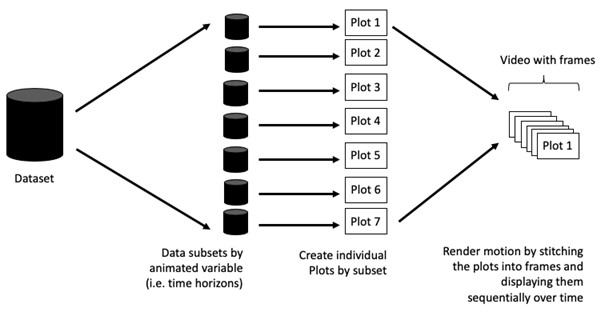

# Basic Concepts of Animation

When creating animations, the plot does not actually move. Instead, many individual plots are built and then stitched together as movie frames, just like an old-school flip book or cartoon. Each frame is a different plot when conveying motion, which is buil using some relevant subset of the aggregate data. The subset drives the flow of the animation when stitched back together.



# Terminology

Before we dive into the steps for creating an animated statistical grpah, it's important to understand some of the key concepts and terminology related to this type fo visualization.

1.  Frame: In an animated line graph, each frame represents a different point in time or a different category. When the drame changes, the data points on the graph are updated to reflect the new data.
2.  Animation Attributes: They are the settings hat control how the animation behaves. For example, you can specify the duration of each frame, teh easing function used to transition between frames, and whether to start the animation from the current frame or from the beginning.

::: callout-tip
Before you start making animated graphs, you should first ask yourself: Does it make sense to go through the effort? If you a conducting an exploratory data analysis, an animated graphic may not be worth the time investment. However, if you are giving a presentation, a few well-placed animated graphics can help an audience connect with your topic remarkably better than static counterparts.
:::

# Getting Started

## Installation of required libraries

|  |  |
|--------|------------------|
| [plotly](https://plotly.com/r/) | R library for plotting interactive statistical graphs |
| [gganimate](https://gganimate.com) | ggplot extension for creating animated statistical graphs |
| [gifski](https://cran.r-project.org/web/packages/gifski/index.html) | converts video frames to GIF animations using png1uant's fancy features for efficient cross-frae palettes and temporal dithering. It produces anumated GIFs that use thousands of colors per frame. |
| [gapminder](https://cran.r-project.org/web/packages/gapminder/index.html) | an excerpt of the data available at Gapminder.org. We just want to use its country_colors scheme. |
| [tidyverse](https://tidyverse.org) | a family of modern R packages specially designed to support data science, analysis and communication taks inclyding creating static statistical graphs |

: {tbl-colwidths="[15,85]"}

```{r}
pacman::p_load(readxl, gifski, gapminder,
               plotly, gganimate, tidyverse)
```

## Importing data

In this hands-on exercise, the Data worksheet from GlobalPopulation Excel workbook will be used. The code chunk below is used to import the data from GlobalPopulation by using appropriate R package from tidyverse family. 

```{r}
#| eval: false
col <- c("Country", "Continent")
globalPop <- read_xls("GlobalPopulation.xls",
                      sheet="Data") %>%
  mutate_each_(funs(factor(.)), col) %>%
  mutate(Year = as.integer(Year))
```

::: callout-note
### Things to learn from the code chunk above

-   `read_xls()` of readxl package is used to import the Excel worksheet
-   `mutate_each_()` of dplyr package is used to convert all character data type into factor
-   `mutate` of dplyr package is used to convert data values of Year field into integer
:::

Unfortunately, `mutate_each_()` was deprecated in dplyr 0.7.0. and funs() was deprecated in dplyr 0.8.0. In view of this, we will re-write the code by using `mutate_at()` as shown in the code chunk below.

```{r}
col <- c("Country", "Continent")
globalPop <- read_xls("GlobalPopulation.xls",
                      sheet="Data") %>%
  mutate_at(col, as.factor) %>%
  mutate(Year = as.integer(Year))
```

`across()` is also another alternative that can be used to derive the same outputs.

```{r}
#| eval: false
col <- c("Country", "Continent")
globalPop <- read_xls("GlobalPopulation.xls",
                      sheet="Data") %>%
  mutate(across(col, as.factor)) %>%
  mutate(Year = as.integer(Year))
```

# Animated Data Visualisation: gganimate methods

gganimate extensd the grammar of grahics as implemented by ggplot to include the description of animation. It does this by providing a range of new grammar classes that can be added to the plot object in otder to customise how it should change with time.

-   `trainsisition_*()` defines how the data should be spread out and how it relates to itself across time
-   `view_*()` defines how the positional scales should change along the animation
-   `shadow_*()` defines how data from other points in time should be presented in the given point in time
-   `enter_*()` / `exit_*()` defines how new data should appear and how old data should disappear during the course of the animation
-   ease_aes() defines how different aesthetics should be eased during transitions

## Building a static population bubble plot

Below is a basic static bubble plot
```{r}
ggplot(globalPop, aes(x = Old, y = Young, 
                      size = Population, 
                      colour = Country)) +
  geom_point(alpha = 0.7, 
             show.legend = FALSE) +
  scale_colour_manual(values = country_colors) +
  scale_size(range = c(2, 12)) +
  labs(title = 'Year: {frame_time}', 
       x = '% Aged', 
       y = '% Young') 
```

## Building the animated bubble plot

```{r}
ggplot(globalPop, aes(x = Old, y = Young, 
                      size = Population, 
                      colour = Country)) +
  geom_point(alpha = 0.7, 
             show.legend = FALSE) +
  scale_colour_manual(values = country_colors) +
  scale_size(range = c(2, 12)) +
  labs(title = 'Year: {frame_time}', 
       x = '% Aged', 
       y = '% Young') +
  transition_time(Year) +    
  ease_aes('linear')
```

::: callout-note
### Things to learn from the code chunk

-   `transition_time()` of gganimate is used to create transitio through distinct states in time (ex. Year)
-   'ease_aes()` is used ot control easing of aesthetics. The default is linear. Other methods are: quadratic, cubic, quartic, quintic, sine, circular, exponential, elastic, back, and bounce
:::

# Animated Data Visualisation: plotly

Both `ggplotly()` and `plot_ly()` support key frame animations through the `frame` argument/aethetic. They also support an `ids` argument/aesthetic to ensure smooth transitions between objects with the same id (which helps facilitate object constancy).

## Building an animated bubble plot: `ggplotly()` method

```{r}
gg <- ggplot(globalPop, 
       aes(x = Old, 
           y = Young, 
           size = Population, 
           colour = Country)) +
  geom_point(aes(size = Population,
                 frame = Year),
             alpha = 0.7, 
             show.legend = FALSE) +
  scale_colour_manual(values = country_colors) +
  scale_size(range = c(2, 12)) +
  labs(x = '% Aged', 
       y = '% Young')

ggplotly(gg)
```

The animated bubble plot above includes a play.pause button and a slider component for controlling the animation.

::: callout-note
### Things to learn from the code chunk

-   Appropriate ggplot functions are used to create a static bubble plot. The output is then saved as a R object called gg.
-   `ggplotly()` is then used to convert the R graphic object into an animated svg object
:::

Notice that alghotuh `show.legend = FALSE` argument is used, the legend still apperas on the plot. To overcome this problem, `theme(legend.position='none')` should be usedas shown in the plot and code chunk below.

```{r}
gg <- ggplot(globalPop, 
       aes(x = Old, 
           y = Young, 
           size = Population, 
           colour = Country)) +
  geom_point(aes(size = Population,
                 frame = Year),
             alpha = 0.7) +
  scale_colour_manual(values = country_colors) +
  scale_size(range = c(2, 12)) +
  labs(x = '% Aged', 
       y = '% Young') + 
  theme(legend.position='none')

ggplotly(gg)
```

## Building an animated bubble plot: `plot_ly()` method

```{r}
bp <- globalPop %>%
  plot_ly(x = ~Old, 
          y = ~Young, 
          size = ~Population, 
          color = ~Continent,
          sizes = c(2, 100),
          frame = ~Year, 
          text = ~Country, 
          hoverinfo = "text",
          type = 'scatter',
          mode = 'markers'
          ) %>%
  layout(showlegend = FALSE)
bp
```

