## Contents

1.  Overview & Data
2.  Target Variable Distributions
3.  Risk Factor Distributions
4.  Claims History
5.  Product Mix (Policy Type)
6.  Driving Environment (Circulation Area)
7.  Driving Experience
8.  Driver Age
9.  Vehicle Age
10. Temporal Trends

::: notes
We will go through 10 things in this slide which includes the overview, data, variables, and insights from univariate, bivariate and temporal analysis.
:::

## Overview & Data

-   **Dataset:** 354,140 motor vehicle insurance policy records from a Spanish insurer (2022-2024)
-   **After cleaning:** 352,289 records across 47 variables
-   **Target Variables:**
    -   `loss_ratio` - profitability metric (total incurred / total premium)
    -   `total_incurred` - volatility metric (absolute claim costs)
-   **Key Risk Factor Analyzed:**
    -   Claims history, product mix, driving environment
    -   Driver & vehicle characteristics, temporal trends
-   **Statistical Approach:** Non-parametric tests (Kruskal-Wallis, Mann-Whitney U, Spearman) used throughout due to non-normal distributions confirmed by Shapiro-Wilk test.

::: {.notes}
This presentation explores a real-world motor vehicle insurance dataset from a Spanish insurer, comprising 352,289 policy records spanning 2022 to 2024. The analysis is structured into univariate exploration of key variables, followed by bivariate analysis examining how various risk factors influence portfolio profitrability, measured by loss ratio, and volatility, measured by total incurred costs. Statistical tests including Krukal-Wallis and Spearman rank correlation are used throughout to validate findings.
:::

## Target Variable Distributions

:::: {.columns}
::: {.column width="50%"}
**Volatility - Total Incurred**

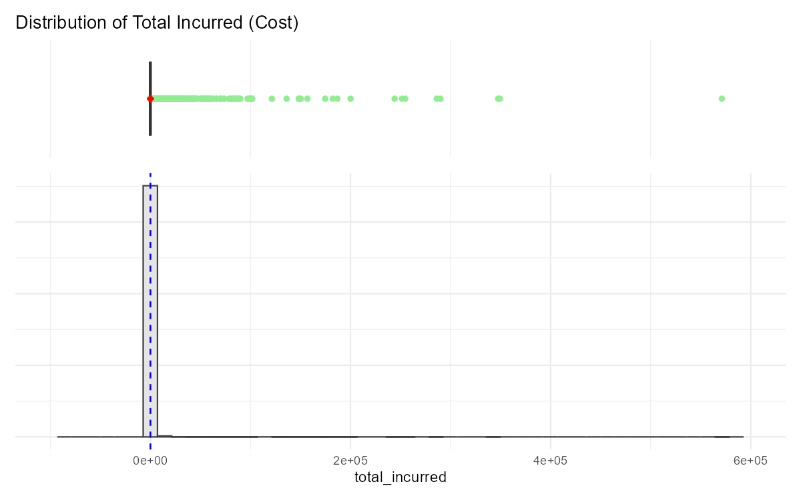

::: {style="font-size: 0.7em"}
- Severely zero-inflated — majority of policies incur no claims
- Mean (208.4) far exceeds median (0), pulled by extreme outliers
- Max value of 571,128 indicates catastrophic claim potential
:::
:::
::: {.column width="50%"}
**Profitability - Loss Ratio**

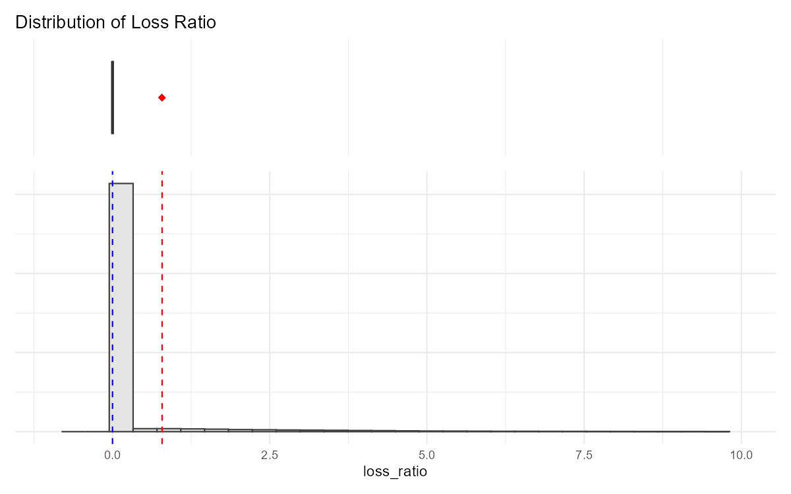

::: {style="font-size: 0.7em"}
- Similarly zero-inflated with median of 0
- 243 policies exceed loss ratio of 100
- Mean (0.788) heavily influenced by catastrophic outlier policies
:::
:::
::::

::: {.notes}
Both target variables exhibit severe zero-inflation and right skew, which is typical in insurance portfolios where most policyholders make no claims in a given year. The zero-inflated nature of both distributions means that median values are uninformative, and the mean is heavily distorted by a small number of catastrophic claims. This has important implications for how profitability and volatility are interpreted — average figures alone can be misleading without understanding the underlying distribution shape.
:::

## Risk Factor Distributions

:::: {.columns}
::: {.column width="50%"}
**Numerical Factors**

::: {style="font-size: 0.90em"}
- `total_premium` — right-skewed, median 257.75, concentrated mid-range
- `total_claims` — zero-inflated, mean 0.22, most policies make no claims
- `driver_age` — approximately normal, median 48, portfolio skews older
- `vehicle_age` — broadly distributed, median 25, older vehicle portfolio
- `driving_experience` — mirrors vehicle age, median 25, mostly experienced drivers
:::
:::
::: {.column width="50%"}
**Categorical Factors**

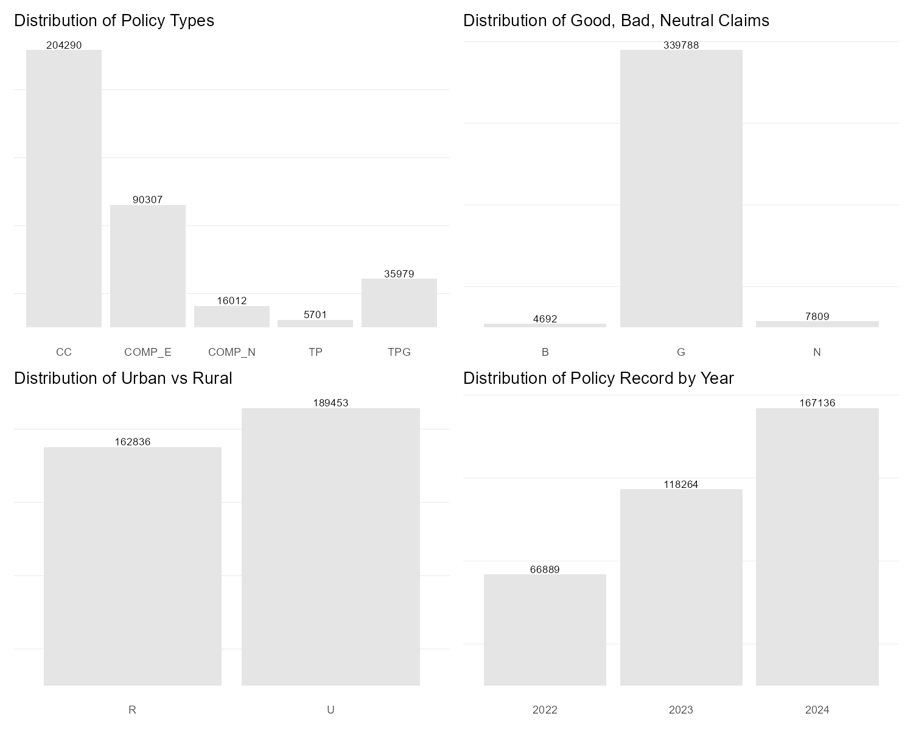
:::
::::

::: {.notes}
The risk factor distributions reveal several important portfolio characteristics. The numerical variables show that most drivers are middle-aged and experienced, operating older vehicles with moderate premiums. Claim frequency is very low across the board, consistent with the zero-inflation seen in the target variables. On the categorical side, the dominance of CC policies means portfolio performance is heavily tied to one product type. The predominantly good bonus scores suggest a low-risk customer base, though the minority of bad scores may disproportionately drive losses as seen in the bivariate analysis.
:::

## Claims History

:::: {.columns}
::: {.column width="50%"}
**Profitabiliy (Loss Ratio)**

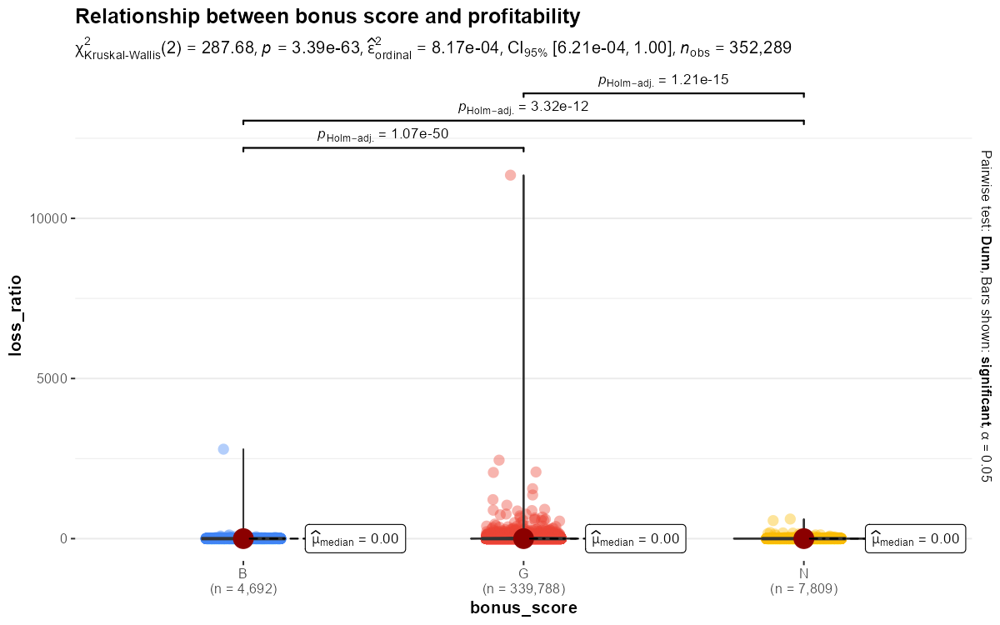

::: {style="font-size: 0.7em"}
- Kruskal-Wallis: χ²(2) = 287.68, p = 3.39e-63
- All three groups differ significantly from each other
- Bad score group (n = 4,692) shows wider spread of extreme loss ratios despite small size
:::
:::

::: {.column width="50%"}
**Volatility (Total Incurred)**

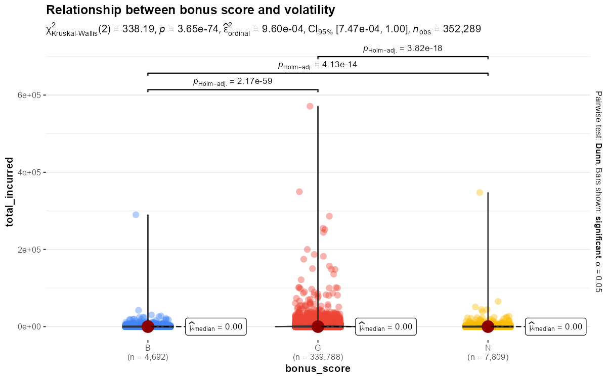

::: {style="font-size: 0.7em"}
- Kruskal-Wallis: χ²(2) = 338.19, p = 3.65e-74
- Bad score group shows higher spread of incurred costs relative to group size
- Good score group (n = 339,788) dominates portfolio but bad score minority drives disproportionate losses
:::
:::
::::

::: {.notes}
Both profitability and volatility are significantly affected by bonus score. Despite the bad bonus score group being a small minority of 4,692 policyholders compared to 339,788 good score holders, they exhibit notably wider spreads in both loss ratio and total incurred costs. All pairwise comparisons are statistically significant across both target variables, confirming that claims history is a meaningful differentiator of risk. The good score dominance suggests overall portfolio health, but the bad score tail represents a concentrated source of losses that warrants closer underwriting scrutiny.
:::

## Product Mix (Policy Type)

:::: {.columns}
::: {.column width="50%"}
**Profitabiliy (Loss Ratio)**

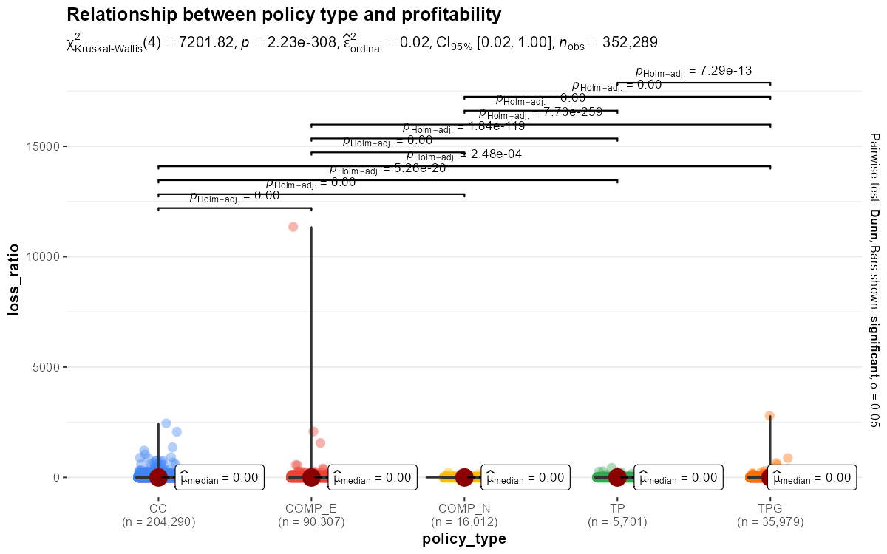

::: {style="font-size: 0.7em"}
- Kruskal-Wallis: χ²(4) = 7201.82, p = 2.23e-308
- All pairwise comparisons statistically significant
- COMP_E shows widest spread of extreme loss ratios despite being second largest group (n = 90,307)
:::
:::

::: {.column width="50%"}
**Volatility (Total Incurred)**

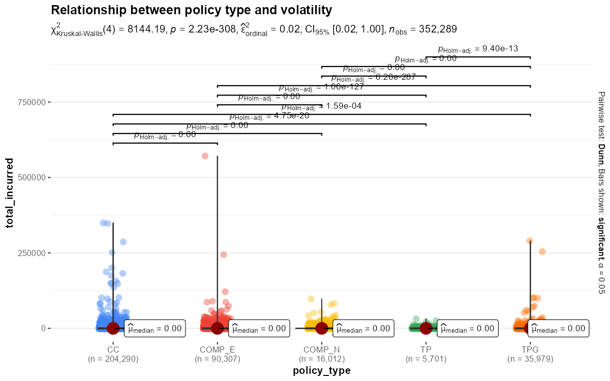

::: {style="font-size: 0.7em"}
- Kruskal-Wallis: χ²(4) = 8144.19, p = 2.23e-308
- COMP_E again shows highest spread of incurred costs
- CC dominates portfolio (n = 204,290) but COMP_E drives disproportionate volatility
:::
:::
::::

::: {.notes}
Policy type is one of the strongest differentiators of both profitability and volatility in this portfolio, with Kruskal-Wallis tests returning the maximum computable p-value of 2.23e-308 for both target variables. All pairwise comparisons are statistically significant. COMP_E consistently stands out as the most volatile policy type, showing the widest spread of extreme loss ratios and incurred costs relative to its size. The portfolio is heavily concentrated in CC policies which account for 204,290 of 352,289 records, meaning overall portfolio performance is strongly tied to this single product type. The limited diversification across policy types represents a concentration risk worth monitoring.
:::

## Driving Environment (Circulation Area) {style="font-size: 0.6em"}

:::: {.columns}
::: {.column width="50%"}
**Profitability (Loss Ratio)**

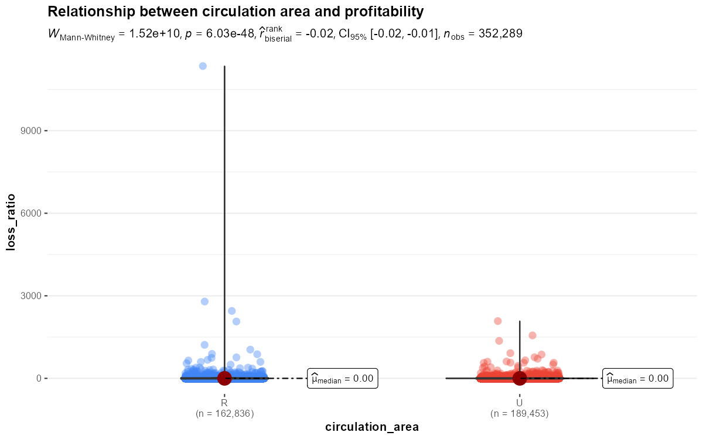

::: {style="font-size: 0.8em"}
- Mann-Whitney U: W = 1.52e+10, p = 6.03e-48
- Rural (R, n = 162,836) shows wider spread of extreme loss ratios
- Effect size small (r = -0.02) — statistically significant but practically modest
:::
:::

::: {.column width="50%"}
**Volatility (Total Incurred)**

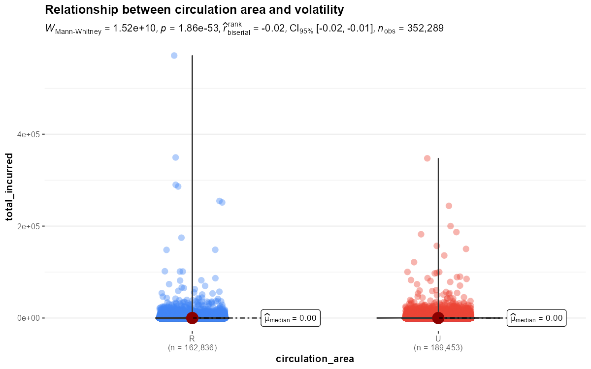

::: {style="font-size: 0.8em"}
- Mann-Whitney U: W = 1.52e+10, p = 1.86e-53
- Rural area again shows higher spread of incurred costs
- Effect size remains small (r = -0.02), consistent with profitability finding
:::
:::
::::

::: {.notes}
Both profitability and volatility differ significantly between rural and urban policyholders. Surprisingly, rural policyholders show wider spreads of extreme values compared to urban, which is counterintuitive given the expectation that urban areas have higher accident rates. This may be explained by rural accidents tending to be more severe when they do occur, driving higher individual claim costs. However, the effect size of -0.02 in both cases indicates the practical difference is modest, suggesting circulation area alone is not a dominant risk factor.
:::

## Driving Experience

:::: {.columns}
::: {.column width="50%"}
**Profitability (Loss Ratio)**

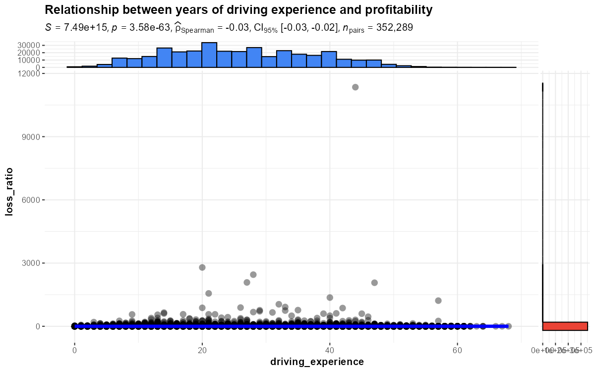

::: {style="font-size: 0.7em"}
- Spearman: ρ = -0.03, p = 3.58e-63
- Weak but significant negative correlation — more experience, slightly lower loss ratio
- Effect size very small, experience alone not a strong standalone predictor
:::
:::

::: {.column width="50%"}
**Volatility (Total Incurred)**

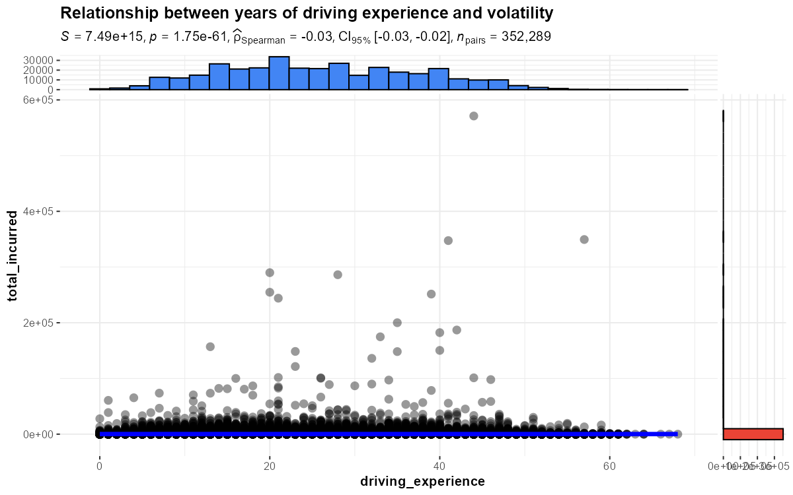

::: {style="font-size: 0.7em"}
- Spearman: ρ = -0.03, p = 1.75e-61
- Mirrors profitability finding — weak negative relationship with total incurred
- Consistent direction suggests experience has marginal but real risk-reducing effect
:::
:::
::::

::: {.notes}
Driving experience shows a consistent weak negative correlation across both profitability and volatility, with Spearman correlation of -0.03 in both cases. While statistically significant given the large sample size, the effect size is very small, indicating that driving experience alone explains very little of the variation in loss ratio or total incurred costs. More experienced drivers do tend to have marginally lower loss ratios and incurred costs, but the relationship is not strong enough to be a standalone risk predictor. It likely works in combination with other factors such as vehicle age and bonus score.
:::

## Driver Age

:::: {.columns}
::: {.column width="50%"}
**Profitability (Loss Ratio)**

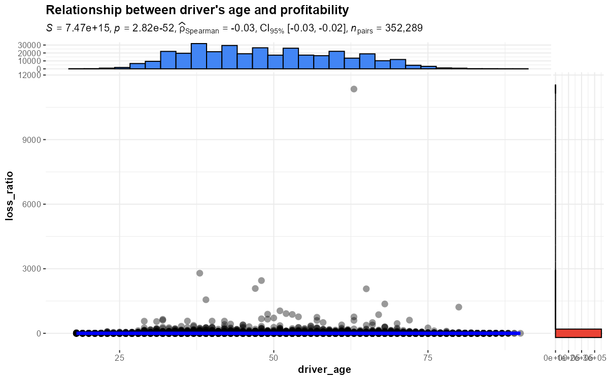

::: {style="font-size: 0.7em"}
- Spearman: ρ = -0.03, p = 2.82e-52
- Weak but significant negative correlation — older drivers tend toward slightly lower loss ratios
- Extreme outliers concentrated in middle age range (40-60)
:::
:::

::: {.column width="50%"}
**Volatility (Total Incurred)**

::: {style="font-size: 0.7em"}
- Spearman: ρ = -0.03, p = 1.11e-50
- Mirrors profitability — older drivers associated with marginally lower incurred costs
- Highest extreme claims also concentrated in middle age range
:::
:::
::::

::: {.notes}
Driver age shows a consistent weak negative correlation with both loss ratio and total incurred costs, with Spearman correlation of -0.03 in both cases. While statistically significant, the effect size is very small, indicating driver age alone explains little of the variation in either target variable. Interestingly, the most extreme outlier values appear concentrated in the middle age range of 40-60 rather than among younger or oldest drivers, which is counterintuitive and may reflect that middle-aged drivers are more represented in higher-risk vehicle categories or coverage types.
:::

## Vehicle Age

:::: {.columns}
::: {.column width="50%"}
**Profitability (Loss Ratio)**

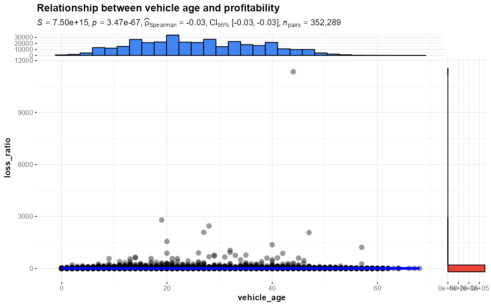

::: {style="font-size: 0.7em"}
- Spearman: ρ = -0.03, p = 3.47e-67
- Weak but significant negative correlation — older vehicles associated with slightly lower loss ratios
- Extreme outliers spread across all vehicle age ranges
:::
:::

::: {.column width="50%"}
**Volatility (Total Incurred)**

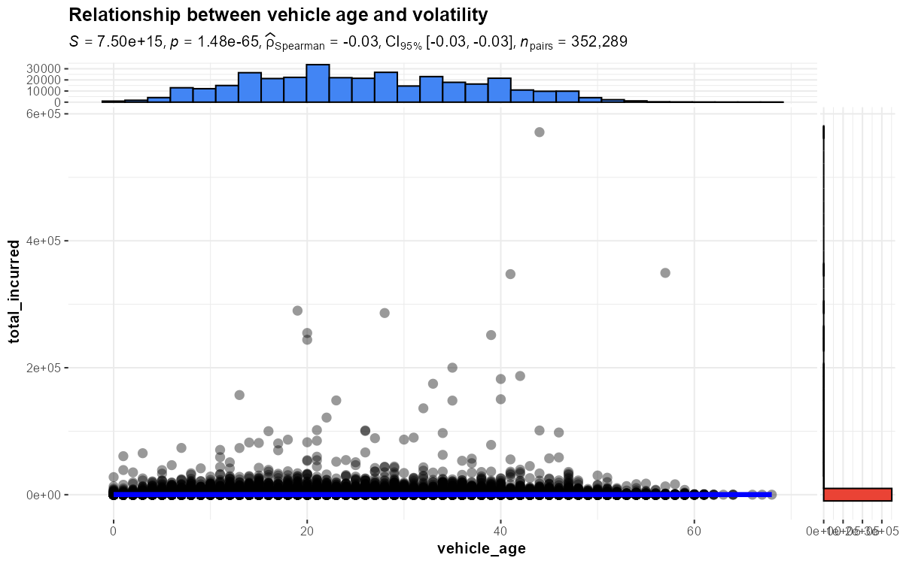

::: {style="font-size: 0.7em"}
- Spearman: ρ = -0.03, p = 1.48e-65
- Consistent negative relationship with total incurred costs
- Effect size small — vehicle age works in combination with other risk factors
:::
:::
::::

::: {.notes}
Vehicle age shows the same pattern as driver age — a statistically significant but weak negative Spearman correlation of -0.03 with both profitability and volatility. Older vehicles are marginally associated with lower loss ratios and incurred costs, which may seem counterintuitive but could reflect that older vehicles carry lower insured values, resulting in lower claim payouts even when accidents occur. The effect size remains very small across both target variables, reinforcing that vehicle age alone is not a dominant standalone predictor and likely interacts with coverage type and vehicle value.
:::

## Temporal Trends (2022–2024)

::: {.panel-tabset}

### Profitability
:::: {.columns}
::: {.column width="50%"}
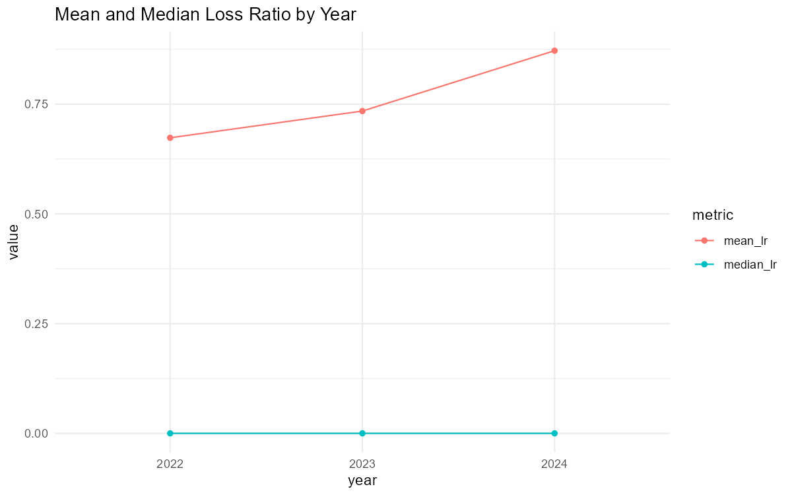
:::
::: {.column width="50%"}

:::
::::

::: {style="font-size: 0.7em"}
- Mean loss ratio rose steadily: 0.68 (2022) → 0.74 (2023) → 0.85 (2024)
- Median remains 0 — rise driven by outlier claims not broad deterioration
- Kruskal-Wallis: χ²(2) = 196.05, p = 2.69e-43, all pairwise significant
- 2024 shows widest spread of extreme loss ratios
:::

### Volatility
:::: {.columns}
::: {.column width="50%"}
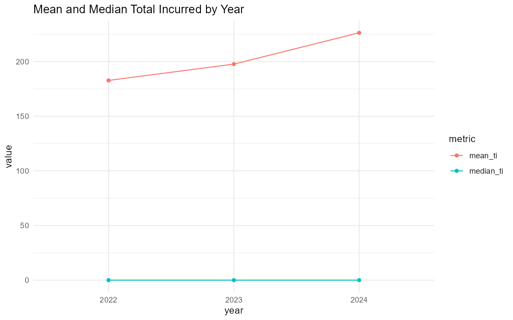
:::
::: {.column width="50%"}
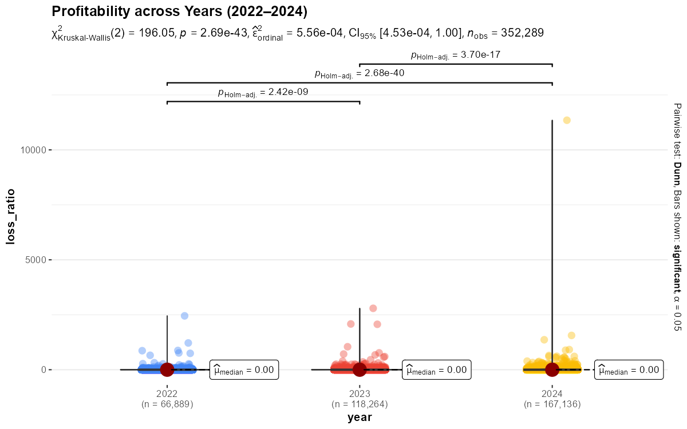
:::
::::

::: {style="font-size: 0.7em"}
- Mean total incurred rose: 183 (2022) → 199 (2023) → 228 (2024)
- Median remains 0 — rising mean driven by growing tail of severe claims
- Kruskal-Wallis: χ²(2) = 215.90, p = 1.31e-47, all pairwise significant
- 2024 exhibits widest spread of extreme incurred values
:::

:::

::: {.notes}
Both profitability and volatility show consistent deterioration from 2022 to 2024, with mean loss ratio rising from 0.68 to 0.85 and mean total incurred rising from 183 to 228. The median remaining at 0 throughout confirms this is driven by a growing tail of catastrophic claims rather than broad portfolio deterioration. Kruskal-Wallis tests confirm all year-on-year differences are statistically significant. Note that 2022 has substantially fewer records (n = 66,889) compared to 2023 (n = 118,264) and 2024 (n = 167,136), which should be interpreted with caution as the smaller 2022 sample may underrepresent that year's true distribution.
:::

